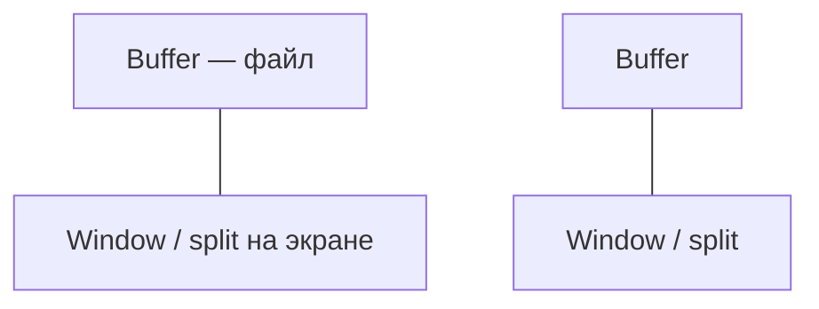

# Neovim — гайд и шпаргалка

Конфиг: [`nvim/`](../nvim/). Leader: **Пробел** (`mapleader`). Local leader: **\\**.

Навигация в tmux: [vim-tmux-navigator](https://github.com/christoomey/vim-tmux-navigator) + [tmux-guide.md](./tmux-guide.md).

## Иерархия (что есть что)



| Уровень | В Neovim | На экране | Не путать с |
|---------|----------|-----------|-------------|
| Буфер | **Buffer** | вкладка в **bufferline** (сверху) | tmux **window** |
| Окно | **Window** (split) | несколько областей редактирования | tmux **pane** |
| Вкладка | Tabpage (почти не используется) | — | bufferline = буферы, не tabpages |

**tmux window** ≈ отдельный «проект/контекст». **nvim buffer** ≈ открытый файл в одной tmux pane.

## vim-tmux-navigator

| Клавиши | Действие |
|---------|----------|
| `C-h` | влево (split или pane tmux) |
| `C-j` | вниз |
| `C-k` | вверх |
| `C-l` | вправо |
| `C-\` | предыдущая pane tmux |

Плагин: [`nvim/lua/plugins/tmux-navigator.lua`](../nvim/lua/plugins/tmux-navigator.lua).

**ToggleTerm** открывается через **Space** `tt` (`C-\` занят navigator).

Диагностика: `:TmuxNavigatorProcessList`.

## Сплиты (окна nvim)

Новые сплиты: снизу (`splitbelow`) и справа (`splitright`).

| Действие | Команда |
|----------|---------|
| Вертикальный сплит | `:vsplit` / `:vsp [файл]` |
| Горизонтальный | `:split` / `:sp [файл]` |
| Закрыть окно | `:close` / `Ctrl+w` `c` |
| Закрыть и выйти из файла | `:q` |
| Равные размеры | `Ctrl+w` `=` |
| Перейти между сплитами | `C-h` `C-j` `C-k` `C-l` (navigator) |

## Буферы и файлы

Полоска **bufferline** сверху — открытые буферы (не tmux windows).

| Действие | Клавиши / команда |
|----------|-------------------|
| Следующий буфер | `:bnext` или клик по bufferline |
| Предыдущий | `:bprevious` |
| Закрыть буфер | `:bd` |
| Найти файл | **Space** `ff` (Telescope) |
| Grep по проекту | **Space** `fg` |
| Список буферов | **Space** `fb` |
| Дерево файлов | **Space** `e` |
| Фокус дерева на файле | **Space** `ef` |

## Leader-меню (Space)

| Клавиши | Действие |
|---------|----------|
| `ff` | Find files |
| `fg` | Live grep |
| `fb` | Buffers |
| `e` | NvimTree toggle |
| `ef` | NvimTree find file |
| `tt` | ToggleTerm |
| `gg` | LazyGit |
| `rn` | LSP rename |
| `ca` | LSP code action |
| `f` | LSP format |
| `xx` | Trouble diagnostics |
| `xq` | Trouble quickfix |
| `hs` | Gitsigns stage hunk |
| `hr` | Gitsigns reset hunk |
| `hp` | Gitsigns preview hunk |
| `Rs` | Kulala: отправить HTTP-запрос (в `.http`) |
| `Ra` | Kulala: все запросы в буфере |
| `Rb` | Kulala: scratchpad |

Подсказки: **Space** (пауза) — which-key. Kulala подробнее: [kulala-guide.md](./kulala-guide.md).

## LSP и диагностика

Активны после `LspAttach` (Mason + lspconfig).

| Клавиши | Действие |
|---------|----------|
| `gd` | Definition |
| `gy` | Type definition |
| `gi` | Implementation |
| `gr` | References |
| `K` | Hover |
| `[d` | Prev diagnostic |
| `]d` | Next diagnostic |
| `]h` | Next git hunk |
| `[h` | Prev git hunk |

Float с полным текстом ошибки: задержка на строке с диагностикой (`updatetime` 300 ms).

## Treesitter (движение по коду)

| Клавиши | Действие |
|---------|----------|
| `]m` / `[m` | след./пред. функция |
| `]M` / `[M` | след./пред. class |
| `af` / `if` | select function outer/inner |
| `ac` / `ic` | select class outer/inner |

## Автодополнение (Insert mode)

| Клавиши | Действие |
|---------|----------|
| `Tab` | следующий пункт / snippet jump |
| `S-Tab` | предыдущий / snippet back |
| `C-Space` | открыть меню |
| `C-e` | закрыть меню |
| `CR` | подтвердить |
| `C-b` / `C-f` | скролл документации |

## Полезные команды

| Команда | Назначение |
|---------|------------|
| `:Lazy` | менеджер плагинов |
| `:Mason` | LSP/форматеры/линтеры |
| `:ConformInfo` | какие форматеры на ft |
| `:Trouble` | диагностика / quickfix UI |
| `:GetTest` | PHP: класс ↔ тест (tdd.nvim) |

Форматирование на save: Conform (см. `extras.lua`).

## Типичный сценарий

1. В tmux pane: `nvim .`
2. **Space** `ff` — открыть файл
3. `:vsp` — референс/тест рядом
4. **C-l** — в соседнюю tmux pane с `go test` / `npm test`
5. **Space** `xx` — список ошибок по файлу
6. **Space** `tt` — плавающий терминал в nvim

```text
tmux window "code"
└── pane nvim
    ├── bufferline: file1 | file2 | ...
    ├── split: main.lua
    └── split: test.lua     ← C-h/j/k/l
└── pane shell              ← C-l из крайнего split
```

## Частые вопросы

| Вопрос | Ответ |
|--------|--------|
| Где «вкладки»? | **Buffers** (bufferline), не tmux windows |
| `C-l` не чистит экран | В связке с tmux это navigator |
| Конфликт клавиш | `:verbose nmap <C-h>` — смотреть источник |
| Плагин navigator не в lazy | `:Lazy sync`, файл `tmux-navigator.lua` |

## Шпаргалка Neovim (копипаст)

```text
LEADER = Space

ФАЙЛЫ                    СПЛИТЫ / ФОКУС           TMUX
  ff  find files            :vsp / :sp              C-hjkl  split/pane
  fg  live grep             :q  close               C-\     prev pane
  fb  buffers
  e   tree                  LSP
  tt  terminal                gd gr K  nav/hover
  gg  lazygit                 [d ]d   diagnostics
                            Space rn ca f  rename/action/format
GIT                         Space xx xq  trouble
  ]h [h  hunks
  Space hs hr hp

ДОПОЛНИТЕЛЬНО
  ]m [m   function (treesitter)
  :Lazy  :Mason  :GetTest (PHP)
```

См. также: [cheatsheet.md](./cheatsheet.md), [tmux-guide.md](./tmux-guide.md), [kulala-guide.md](./kulala-guide.md), [plugin-notes.md](../nvim/plugin-notes.md).
