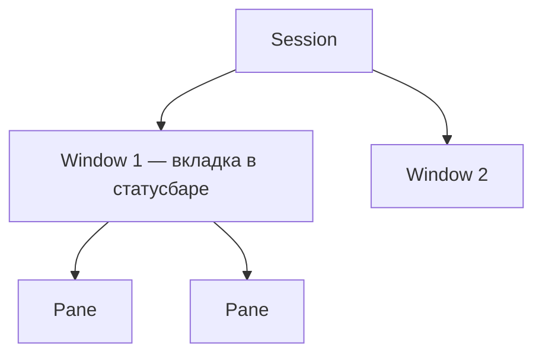

# tmux — гайд и шпаргалка

Конфиг: [`.tmux.conf`](../.tmux.conf). Навигация между pane и Neovim: [vim-tmux-navigator](https://github.com/christoomey/vim-tmux-navigator).

## Иерархия (что есть что)



| Уровень | В tmux | На экране | Аналог |
|---------|--------|-----------|--------|
| Сессия | **Session** | `tmux ls`, имя слева в статусбаре (`#S`) | профиль браузера |
| Вкладка | **Window** | полоска `#1·name` внизу | вкладка Chrome |
| Панель | **Pane** | деление внутри окна | два окна рядом |

**Важно:** «вкладки» в tmux — это **windows**, не панели. Панели — это **panes** внутри одного window.

## Префикс

По умолчанию: **Ctrl+b**, затем клавиша команды.

В статусбаре слева при активном префиксе: **●** (иначе **·**).

Команды **ниже с префиксом** — пишем как `C-b c` (= Ctrl+b, отпустить, `c`).

## vim-tmux-navigator — что делает и чего не делает

| Делает | Не делает |
|--------|-----------|
| **Ctrl+h/j/k/l** — переход между panes | Не создаёт windows |
| В pane с nvim — сначала сплиты, потом соседняя pane | Не создаёт panes |
| **Ctrl+\\** — предыдущая pane | Не заменяет **Ctrl+b** для вкладок |

Префикс для navigator **не нужен**.

### Поведение

1. Фокус в **shell** → **Ctrl+hjkl** переключает panes tmux.
2. Фокус в **nvim** → **Ctrl+hjkl** ходит по сплитам; на краю — выходит в соседнюю pane.
3. В **copy-mode** (vi) → те же **Ctrl+hjkl** для panes.

Проверка из nvim: `:TmuxNavigatorProcessList` — в списке должен быть `nvim`.

## Окна (вкладки)

Новое окно открывается в **текущей директории** pane (`new-window -c "#{pane_current_path}"`).

| Действие | Клавиши |
|----------|---------|
| Новое окно | `C-b` `c` |
| Следующее / предыдущее | `C-b` `n` / `C-b` `p` |
| Окно №0–9 | `C-b` `0` … `C-b` `9` |
| Список окон | `C-b` `w` |
| Переименовать | `C-b` `,` |
| Закрыть окно | `C-b` `&` |
| Найти окно по имени | `C-b` `f` |

## Панели (panes)

| Действие | Клавиши | В конфиге |
|----------|---------|-----------|
| Сплит слева/справа | `C-b` `\|` | `split-window -h` |
| Сплит сверху/снизу | `C-b` `-` | `split-window -v` |
| Закрыть pane | `C-b` `x` | |
| Zoom pane | `C-b` `z` | |
| Убить pane | `exit` или `C-d` | |
| Синхронный ввод во все panes | `C-b` `:` → `setw synchronize-panes` | в статусбаре `SYNC` |

Мышь **включена** — клик по pane переключает фокус.

## Навигация (navigator, без префикса)

| Клавиши | Действие |
|---------|----------|
| `C-h` | pane слева |
| `C-j` | pane снизу |
| `C-k` | pane сверху |
| `C-l` | pane справа |
| `C-\` | предыдущая pane |

> **Ctrl+l** в pane с nvim — это навигация, не «очистить экран». Clear в shell: `clear` или `C-l` вне tmux/nvim.

## Сессии

| Действие | Команда |
|----------|---------|
| Новая сессия | `tmux` или `tmux new -s имя` |
| Список | `tmux ls` |
| Подключиться | `tmux attach -t имя` |
| Отсоединиться (сессия живёт) | `C-b` `d` |
| Убить сессию | `tmux kill-session -t имя` |

## Служебное

| Действие | Клавиши / команда |
|----------|-------------------|
| Перезагрузить конфиг | `C-b` `r` |
| Копирование (vi keys) | `C-b` `[`, движение `hjkl`, `v`, `y`, `C-b` `]` |
| Скролл в copy-mode | `C-b` `[`, `PgUp`/`PgDn` |

## Типичный рабочий layout

```text
tmux session "work"
├── Window 0: code
│   ├── pane: nvim          ← C-h/j/k/l между сплитами и в соседнюю pane
│   └── pane: shell/tests
└── Window 1: logs          ← C-b n / p между окнами
```

1. `tmux new -s work`
2. `C-b` `c` — второе окно (логи, второй проект)
3. В окне code: `C-b` `|` — nvim слева, терминал справа
4. В nvim: `C-h` / `C-l` между кодом и shell
5. `C-b` `n` — на окно с логами

## Частые вопросы

| Вопрос | Ответ |
|--------|--------|
| Navigator создаёт вкладки? | Нет, только фокус |
| Где «вкладки»? | **Windows** внизу, `C-b` `c` / `n` / `p` |
| `C-h` в nvim не уходит в tmux | Проверь `:TmuxNavigatorProcessList`; перезагрузи tmux (`C-b` `r`) |
| Конфликт с Neovim | См. [nvim-guide.md](./nvim-guide.md) — те же `C-hjkl` |

## Шпаргалка tmux (копипаст)

```text
ПРЕФИКС = Ctrl+b

ВКЛАДКИ (windows)          ПАНЕЛИ (panes)              НАВИГАЦИЯ (без префикса)
  c     новое окно            |     split │               C-h  влево
  n/p   след/пред             -     split ─               C-j  вниз
  0-9   номер окна            x     закрыть pane          C-k  вверх
  w     список                z     zoom                  C-l  вправо
  ,     переименовать                                   C-\  пред. pane
  &     закрыть окно
  d     detach

  r     reload ~/.tmux.conf
```

См. также: [cheatsheet.md](./cheatsheet.md), [nvim-guide.md](./nvim-guide.md).
